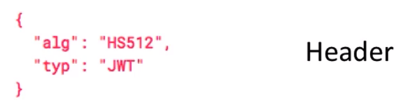
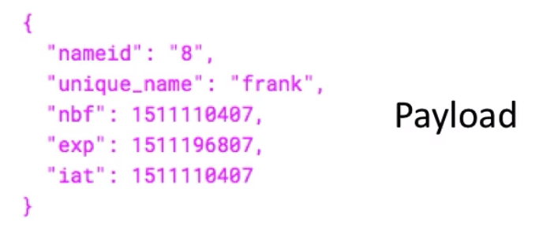
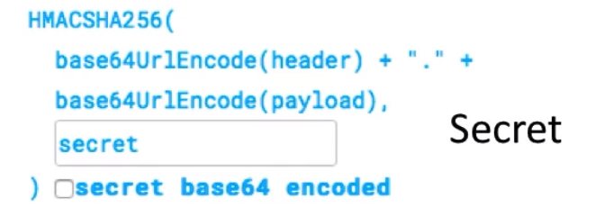
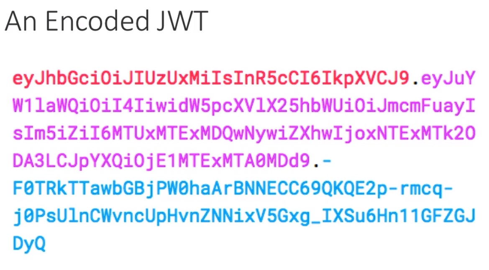
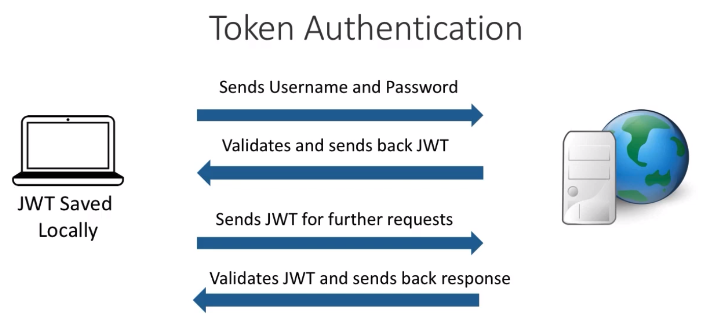
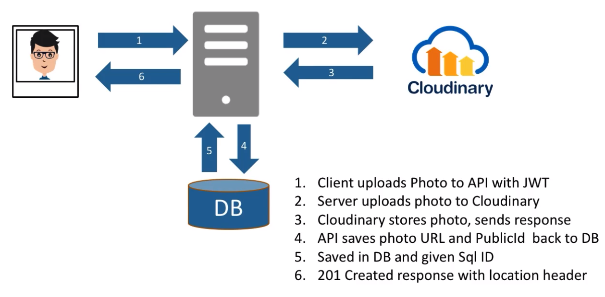

# datingApp

## JWTs
- JSON Web Tokens
    - Industry Standard for tokens (RFC 7519)
    - Self-contained and can contain:
        - Credentials
        - Claims
        - Other Information
- The server doesn't need to go back to the database to validate the user 
    - It should be able to validate the token itself without calling the data store
    - It shouldn't need to use the data store itself to ascertain whether or not the user is authenticated to use the application.
### JWT Structure
- Lives as a text file, but up of three parts
- Things in the header and payload can be decoded by anyone; therefore, precautions must be taken about the type of info that's stored in here. Payload has three timestamps to somewhat address that problem
- 
    - has an algorithm of what was used to encrypt the token in the first place, because part of the token is encrypted and it specifies the type, which in this case is JWT
- 
    - this is the information that's stored inside the token and can contain identifier info, username, and various amounts of information
    - `nbf` stands for "not before" - this is the earliest date the token can be used. Typically it would match `iat`
    - `iat` stands for "issued at" - this is the timestamp for when the token was issued
    - `exp` is the expiration date of the token
- 
    - this is the part that encodes/hashes the header and payload
    - uses the algorithm HS152 to encode/hash the token
    - the secret itself is stored on the server and never revealed to the client
    - the client would send this token to the server and the server would use the secret to validate the token
    - if the secret doesn't match what's on the server, it won't pass validation on the server; the user that tried to invent the token, without the actual secret, won't be able get past the servers validation of this.
- Here's what an encoded JWT looks like 
    - 
    - in color code:
        - the first part is the header
        - second part contains the paylod
        - third part is the signature
- 

## Adding Photo upload functionality to the application
